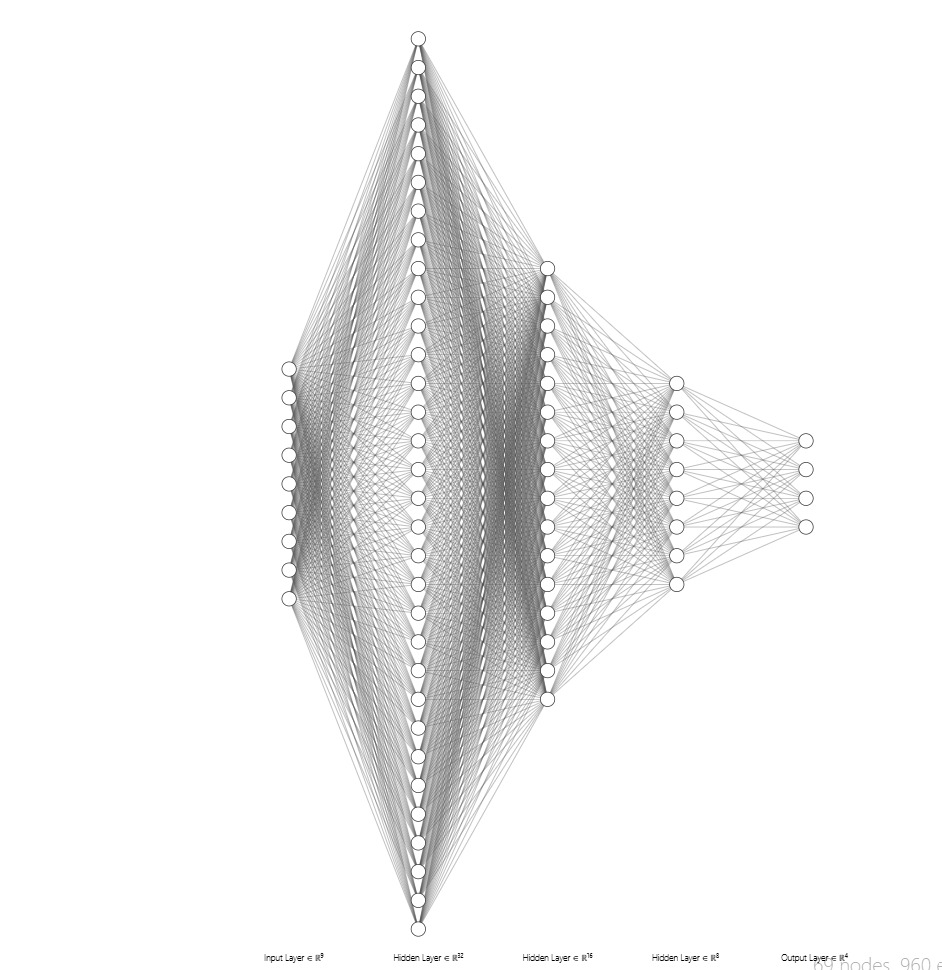
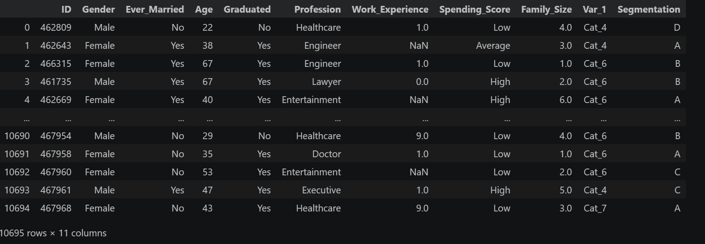
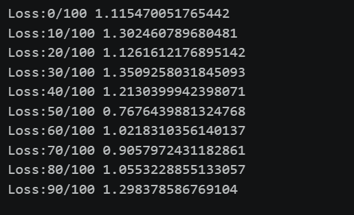
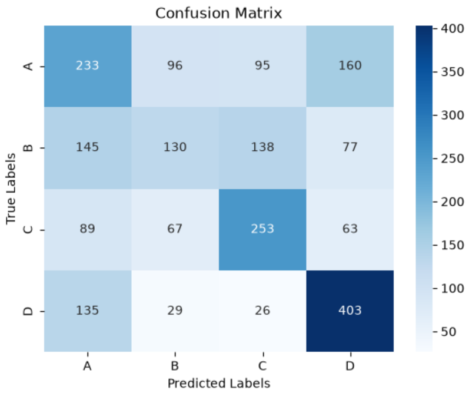
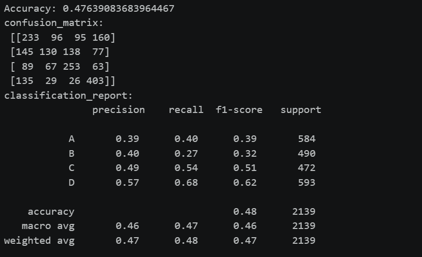
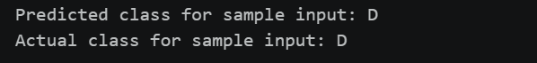

# Developing a Neural Network Classification Model

## AIM
To develop a neural network classification model for the given dataset.

## THEORY
An automobile company has plans to enter new markets with their existing products. After intensive market research, they’ve decided that the behavior of the new market is similar to their existing market.

In their existing market, the sales team has classified all customers into 4 segments (A, B, C, D ). Then, they performed segmented outreach and communication for a different segment of customers. This strategy has work exceptionally well for them. They plan to use the same strategy for the new markets.

You are required to help the manager to predict the right group of the new customers.

## Neural Network Model



## DESIGN STEPS

### STEP 1: 

Data Collection and Understanding – Load the dataset, inspect features, and identify the target variable.


### STEP 2: 

Data Cleaning and Encoding – Handle missing values and convert categorical data and labels into numerical form.


### STEP 3: 

Feature Scaling and Data Splitting – Normalize features and split data into training and testing sets.


### STEP 4: 

Model Architecture Design – Define the neural network layers, neurons, and activation functions.


### STEP 5: 

Model Training and Optimization – Train the model using a loss function and optimizer through backpropagation.


### STEP 6: 

Model Evaluation and Prediction – Evaluate performance using metrics and make predictions on unseen data.


## PROGRAM

### Name: CHANDRU M

### Register Number: 212224230041

```python
import torch
import torch.nn as nn
import torch.optim as optim
import torch.nn.functional as F
from sklearn.preprocessing import LabelEncoder,StandardScaler
from sklearn.model_selection import train_test_split
from sklearn.metrics import accuracy_score,confusion_matrix,classification_report
from torch.utils.data import TensorDataset,DataLoader
import pandas as pd
import numpy as np
import matplotlib.pyplot as plt
df=pd.read_csv("customers.csv")
df
df=df.drop(columns=["ID"])
df
df.columns
df.fillna({"Work_Experience":0,"Family_Size":df["Family_Size"].median()},inplace=True)
df
cat_columns=['Gender','Ever_Married', 'Graduated', 'Profession',
    'Spending_Score', 'Var_1']
for col in cat_columns:
    df[col]=LabelEncoder().fit_transform(df[col])
lbe=LabelEncoder()
df["Segmentation"]=lbe.fit_transform(df["Segmentation"])
df
x=df.drop(columns="Segmentation")
y=df["Segmentation"].values
xt,xst,yt,yst=train_test_split(x,y,test_size=0.2,random_state=42)
scaler=StandardScaler()
xt=scaler.fit_transform(xt)
xst=scaler.transform(xst)
xt=torch.FloatTensor(xt)
xst=torch.FloatTensor(xst)
yt=torch.FloatTensor(yt)
yst=torch.FloatTensor(yst)
tr=TensorDataset(xt,yt)
tst=TensorDataset(xst,yst)
trl=DataLoader(tr,batch_size=16,shuffle=True)
tstl=DataLoader(tst,batch_size=16)
class classifier1(nn.Module):
    def __init__(self,input_size):
        super().__init__()
        self.l1=nn.Linear(input_size,32)
        self.l2=nn.Linear(32,16)
        self.l3=nn.Linear(16,8)
        self.l4=nn.Linear(8,4)
    def forward(self,x):
        x=F.relu(self.l1(x))
        x=F.relu(self.l2(x))
        x=F.relu(self.l3(x))
        x=self.l4(x)
        return x

model=classifier1(input_size=xt.shape[1])
criterion=nn.CrossEntropyLoss()
op=optim.Adam(model.parameters(),lr=0.001)
epochs=100
for i in range(epochs):
    for a,b in trl:
        op.zero_grad()
        pred=model(a)
        loss=criterion(pred,b.long())
        loss.backward()
        op.step()
    if i%10==0:
        print(f"Loss:{i}/{epochs}",loss.item())


pre=[]
act=[]
with torch.no_grad():
    output=model(xst)
    _,predicted=torch.max(output,1)
    pre.extend(predicted.numpy())
    act.extend(yst.numpy())
    print(act,pre)

accuracy=accuracy_score(act,pre)
conf_matrix=confusion_matrix(act,pre)
cl_report=classification_report(act,pre,target_names=['A','B','C','D'])
print("Accuracy:",accuracy)
print("confusion_matrix:\n",conf_matrix)
print("classification_report:\n",cl_report)

import seaborn as sns
import matplotlib.pyplot as plt
xl=['A','B','C','D']
sns.heatmap(conf_matrix, annot=True, cmap='Blues', xticklabels=xl, yticklabels=xl,fmt='g')
plt.xlabel("Predicted Labels")
plt.ylabel("True Labels")
plt.title("Confusion Matrix")
plt.show()


sample_input = xst[12].clone().unsqueeze(0).detach().type(torch.float32)
model.eval()

with torch.no_grad():
    output = model(sample_input)
    predicted_class_index = torch.argmax(output[0]).item()

predicted_class_label = lbe.inverse_transform(
    [predicted_class_index]
)[0]

actual_class_index = int(yst[12].item())
actual_class_label = lbe.inverse_transform(
    [actual_class_index]
)[0]

print(f'Predicted class for sample input: {predicted_class_label}')
print(f'Actual class for sample input: {actual_class_label}')

```

### Dataset Information



### OUTPUT



## Confusion Matrix




## Classification Report



### New Sample Data Prediction



## RESULT

Thus the python program to develop a neural network classification model is executed successfully


